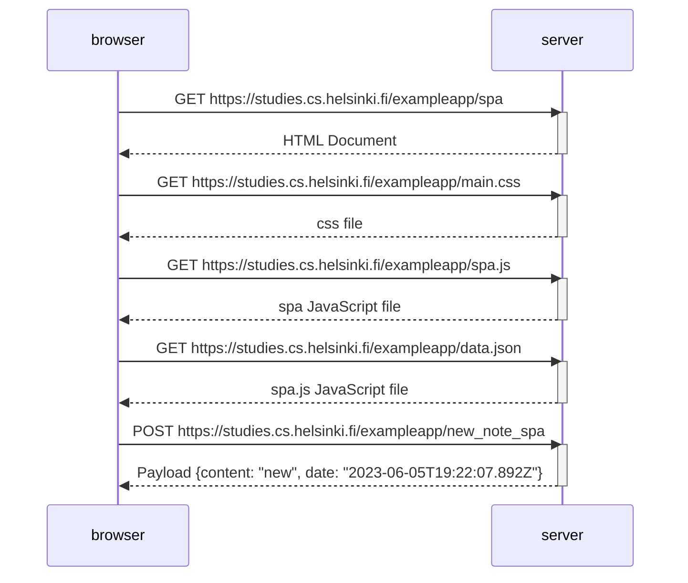

```mermaid
sequenceDiagram
	participant browser
	participant server
	
	browser->>server: GET https://studies.cs.helsinki.fi/exampleapp/spa
    	activate server
    	server-->>browser: HTML Document
    	deactivate server

	browser->>server: GET https://studies.cs.helsinki.fi/exampleapp/main.css
    	activate server
    	server-->>browser: css file
    	deactivate server

	browser->>server: GET https://studies.cs.helsinki.fi/exampleapp/spa.js
    	activate server
    	server-->>browser: spa JavaScript file
    	deactivate server

	browser->>server: GET https://studies.cs.helsinki.fi/exampleapp/data.json
    	activate server
    	server-->>browser: spa.js JavaScript file
    	deactivate server

	
	browser->>server: POST https://studies.cs.helsinki.fi/exampleapp/new_note_spa
    	activate server
    	server-->>browser: Payload {content: "new", date: "2023-06-05T19:22:07.892Z"}
    	deactivate server
```